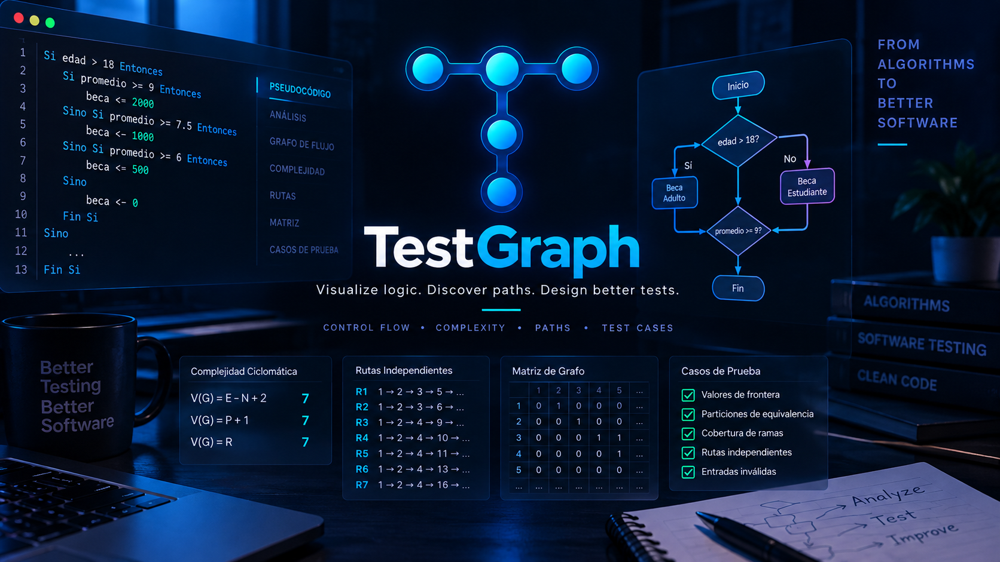

<div align="center">

<p align="center">
  
</p>

<p align="center">
  
</p>


<br/><br/>

<a href="https://github.com/Jairo0811/TestGraph/actions/workflows/ci.yml">
  
</a>

<br/><br/>

**Visualize logic. Discover paths. Design better tests.**

*From algorithms to better software.*

</div>

## 📌 Descripción

**TestGraph** es una plataforma visual de **pruebas de caja blanca y análisis de flujo de control**. Transforma pseudocódigo TGPL en un grafo de flujo de control interactivo, calcula complejidad ciclomática, identifica caminos linealmente independientes, construye matrices de adyacencia y apoya el diseño de casos de prueba estructurales.

La versión `1.0.1` completa la integración real entre frontend y backend: el editor, el CFG, la complejidad, los basis paths, la matriz, las sugerencias, los casos de prueba, los proyectos persistidos y las exportaciones trabajan sobre el mismo pipeline determinístico.

> 🎓 **Origen académico:** TestGraph nace a partir del proyecto final de **Fundamentos de Ingeniería de Software (ISO-300)** de la **Universidad APEC (UNAPEC)**, realizado durante el período **Septiembre - Diciembre 2024**.

---

## 🎓 Información académica

| Información | Detalle |
|---|---|
| 📖 Asignatura | **Fundamentos de Ingeniería de Software (ISO-300)** |
| 👨‍🏫 Profesor | **Leandro Eduardo Fondeur Gil** |
| 🏫 Institución | **Universidad APEC (UNAPEC)** |
| 📅 Período académico | **Septiembre - Diciembre 2024** |
| 📁 Tipo de entrega | **Proyecto Final** |
| 👥 Grupo | **#4** |
| 📅 Entrega original | **5 de diciembre de 2024** |

### 👥 Equipo académico original

| 👤 Integrante | 🆔 Matrícula |
|---|---|
| Francis Jairo Matias Rosario | A00115261 |
| Diego Jose Montero Almonte | A00115699 |
| Robinson Junior Novo Lopez | A00115885 |
| Angel Emmanuel Gonzalez Acosta | A00116360 |
| Christian Rainel Menendez Hiciano | A00116551 |

La versión moderna de **TestGraph** conserva los ejercicios académicos como escenarios de validación, pero constituye una evolución técnica independiente orientada a portafolio.

---

## 🧭 Continuidad académica

Existe una continuidad docente con [**IngSoft Studio**](https://github.com/Jairo0811/IngSoft-Studio). **Leandro Eduardo Fondeur Gil** impartió **Introducción a la Ingeniería en Software (SOF-015)** en el **ITLA** durante **2017-C3** y posteriormente **Fundamentos de Ingeniería de Software (ISO-300)** en **UNAPEC** durante **Septiembre - Diciembre 2024**.

| Orden | Institución | Asignatura | Proyecto | Período |
|---:|---|---|---|---|
| 1 | ITLA | Introducción a la Ingeniería en Software (SOF-015) | [**IngSoft Studio**](https://github.com/Jairo0811/IngSoft-Studio) | 2017-C3 |
| 2 | UNAPEC | Fundamentos de Ingeniería de Software (ISO-300) | **TestGraph** | Septiembre - Diciembre 2024 |

La relación es **docente y formativa**; ambos proyectos son aplicaciones independientes y no existe dependencia técnica entre ellos.

---

## 🎯 Flujo de trabajo

El proceso académico original requería realizar manualmente la identificación de nodos, aristas, regiones, predicados, caminos independientes y casos de prueba. TestGraph automatiza ese flujo:

```text
TGPL Source
    ↓
Lexer
    ↓
Parser
    ↓
AST
    ↓
CFG Builder
    ↓
Control Flow Graph
    ↓
┌──────────────────────────────┐
│ Cyclomatic Complexity        │
│ Basis Paths                  │
│ Adjacency Matrix             │
│ Assisted Test Cases          │
│ Structural Coverage Model    │
└──────────────────────────────┘
```

---

## ✅ Alcance V1

- editor de pseudocódigo TGPL;
- lexer y parser;
- Abstract Syntax Tree (AST);
- generación determinística del Control Flow Graph (CFG);
- visualización interactiva del CFG;
- resaltado de basis paths sobre el grafo;
- cálculo de complejidad ciclomática por formulaciones equivalentes;
- conjunto base de caminos linealmente independientes;
- matriz de adyacencia;
- diseño manual de casos de prueba con vínculo a basis paths;
- sugerencias determinísticas de boundary values;
- Guest Mode + cuentas opcionales con JWT;
- proyectos e historial persistidos en SQL Server;
- muestras académicas originales;
- exportación a PNG, CSV, JSON y Markdown.

---

## 🧠 TGPL — TestGraph Pseudocode Language

TestGraph V1 utiliza un lenguaje de pseudocódigo controlado en lugar de intentar interpretar pseudocódigo arbitrario en lenguaje natural.

```text
Entero edad
Real promedio
Real beca

Leer edad
Leer promedio

Si edad > 18 Entonces
    Si promedio >= 9 Entonces
        beca <- 2000
    Sino Si promedio >= 7.5 Entonces
        beca <- 1000
    Sino Si promedio >= 6 Entonces
        beca <- 500
    Sino
        beca <- 0
    Fin Si
Sino
    Si promedio >= 9 Entonces
        beca <- 3000
    Sino Si promedio >= 8 Entonces
        beca <- 2000
    Sino Si promedio >= 6 Entonces
        beca <- 100
    Sino
        beca <- 0
    Fin Si
Fin Si

Escribir beca
```

Construcciones soportadas:

- declaraciones: `Entero`, `Real`, `Logico`;
- entrada/salida: `Leer`, `Escribir`;
- asignaciones: `<-`;
- condiciones: `Si`, `Sino Si`, `Sino`, `Fin Si`;
- ciclos: `Mientras`, `Para`;
- operadores: `>`, `<`, `>=`, `<=`, `=`, `<>`, `Y`, `O`, `NO`;
- operadores aritméticos usados por TGPL V1.

---

## ⚙️ Motor de análisis

El núcleo es determinístico:

```text
Source Code
    ↓
Lexer → Tokens
    ↓
Parser → AST
    ↓
CFG Builder
    ↓
ControlFlowGraph
    ↓
Complexity / Paths / Matrix / Tests
```

### Complejidad ciclomática

Para un CFG conectado:

```text
V(G) = E - N + 2
V(G) = P + 1
V(G) = R
```

Donde `E` = aristas, `N` = nodos, `P` = nodos predicado y `R` = regiones equivalentes.

### Basis Path Analysis

```text
Basis Paths = V(G)
```

La interfaz permite seleccionar un basis path y resaltarlo directamente sobre el CFG generado por el backend.

### Casos de prueba

El diseñador permite documentar entradas, resultado esperado, técnica y basis path asociado. El backend valida el vínculo estructural y conserva los nodos/aristas cubiertos por cada caso validado.

---

## 🧪 Ejercicios académicos preservados

1. **Matrix Minimum Even** — identificar la columna con el menor número par en una matriz 5x3.
2. **Scholarship Calculator** — calcular una beca según edad y promedio académico.
3. **Numbers Ending in Four** — mostrar números terminados en `4` dentro de un rango.
4. **Find Number 24** — buscar el número `24` en una matriz 4x3.
5. **Discount Calculator** — calcular descuento según umbrales de precio.

TGPL V1 no implementa arreglos/matrices, por lo que **Matrix Minimum Even** y **Find Number 24** se preservan como referencias no ejecutables. Los otros tres ejemplos pueden cargarse directamente en el editor desde la API.

### Scholarship Calculator: discrepancia académica preservada

El trabajo original documentó:

```text
Nodes: 18
Edges: 23
Predicate Nodes: 6
Regions: 7
Cyclomatic Complexity: 7
```

El flujo TGPL preservado contiene **7 decisiones binarias**: una condición de edad y tres decisiones de promedio en cada rama. Por eso TestGraph calcula determinísticamente:

```text
P = 7
V(G) = P + 1 = 8
Basis Paths = 8
```

El valor académico `7` se conserva como contexto histórico; el motor no se modifica para forzar ese resultado manual.

### Discount Calculator

```text
price >= 200       → 15%
price < 100        → 10%
100 <= price < 200 → 12%
```

Complejidad ciclomática: `3`.

---

## 🧱 Stack tecnológico

### Frontend

- React 19;
- TypeScript;
- Vite;
- TanStack Query;
- React Flow / `@xyflow/react`;
- Material UI;
- `html-to-image` para exportar el CFG.

### Backend

- .NET 10;
- ASP.NET Core Web API;
- C#;
- Entity Framework Core;
- JWT Bearer Authentication.

### Datos y herramientas

- Microsoft SQL Server / LocalDB para desarrollo;
- Git / GitHub;
- GitHub Actions.

---

## 🏗️ Arquitectura

TestGraph utiliza **Modular Monolith + Clean Architecture**.

```text
TestGraph.sln

src/
├── TestGraph.Domain
├── TestGraph.Application
├── TestGraph.Analysis
├── TestGraph.Infrastructure
└── TestGraph.Api

tests/
├── TestGraph.Domain.Tests
├── TestGraph.Application.Tests
└── TestGraph.Analysis.Tests

frontend/
└── testgraph-web
```

`TestGraph.Analysis` contiene el motor estructural:

```text
TestGraph.Analysis
├── Lexing
├── Parsing
├── Syntax
├── ControlFlow
├── Complexity
├── Paths
├── Matrix
├── Testing
├── Reporting
└── Samples
```

---

## 🗃️ Persistencia y autenticación

El modelo sigue:

```text
Guest Mode
+
Optional Account
```

El análisis TGPL es público. La autenticación solo es necesaria para guardar proyectos e historial.

Datos persistidos:

- usuario;
- proyecto;
- código fuente TGPL;
- complejidad;
- nodos y aristas del CFG;
- basis paths;
- casos de prueba diseñados.

En `Development`, la base LocalDB se inicializa automáticamente si todavía no existe. Fuera de Development, la clave JWT de ejemplo es rechazada y deben utilizarse secretos/configuración de despliegue reales.

---

## 🔌 API principal

### Pipeline consolidado

```http
POST /api/analysis
```

Devuelve en una sola respuesta:

- CFG;
- complejidad;
- basis paths;
- matriz;
- sugerencias de casos de prueba.

También se mantienen endpoints específicos:

```text
POST /api/analysis/complexity
POST /api/analysis/paths
POST /api/analysis/matrix
POST /api/analysis/test-cases/design
POST /api/analysis/test-cases/suggest

POST /api/auth/register
POST /api/auth/login
GET  /api/auth/me

GET  /api/projects
POST /api/projects
POST /api/projects/{id}/analyses
GET  /api/projects/{projectId}/analyses/{analysisId}

GET  /api/samples
GET  /api/samples/{id}

POST /api/analysis/export/json
POST /api/analysis/export/matrix.csv
POST /api/analysis/report/markdown
```

---

## ▶️ Ejecutar localmente

Requisitos:

- .NET SDK 10;
- Node.js 22+;
- SQL Server LocalDB en Windows para el perfil de desarrollo predeterminado.

### 1. Backend

Desde la raíz:

```powershell
dotnet restore
dotnet build
dotnet test
cd src\TestGraph.Api
dotnet run
```

El perfil local utiliza:

```text
http://localhost:5152
```

Health check:

```text
http://localhost:5152/api/health
```

### 2. Frontend

En otra terminal:

```powershell
cd frontend\testgraph-web
npm install
npm run dev
```

Abrir:

```text
http://localhost:5173
```

Vite envía `/api/*` al backend local mediante proxy.

### 3. Smoke test recomendado

1. Ejecutar el ejemplo **Scholarship Calculator**.
2. Confirmar `V(G)=8` y `8` basis paths.
3. Seleccionar un basis path y comprobar su resaltado en el CFG.
4. Probar otro sample TGPL desde **Academic Samples**.
5. Crear/validar un caso de prueba.
6. Probar JSON, CSV, Markdown y PNG.
7. Crear una cuenta opcional, un proyecto y guardar el análisis.

---

## 🤖 Filosofía de IA

La IA **no forma parte del núcleo matemático ni estructural**. CFG, complejidad, paths, matriz y boundary suggestions son determinísticos. Futuras versiones pueden incorporar IA para explicar resultados o proponer escenarios adicionales sin sustituir el análisis estructural.

---

## 🚫 Fuera de alcance de V1

- parsing directo de C#/Java/JavaScript/TypeScript/Python;
- análisis automático de repositorios GitHub;
- instrumentación runtime;
- mutation testing;
- load testing;
- security testing como suite especializada;
- static analysis empresarial;
- sintaxis TGPL de arreglos/matrices;
- generación PDF.

### Evolución futura

- **V2 — Real Source Code:** soporte inicial de C# con Roslyn cuando aporte valor.
- **V3 — Repository Analysis:** análisis de métodos complejos y priorización de refactorización/pruebas.

---

## 🗺️ Roadmap

| Fase | Alcance | Estado |
|---:|---|:---:|
| 0 | Definición del producto y fundación técnica | ✅ |
| 1 | Solution Foundation | ✅ |
| 2 | TGPL Lexer | ✅ |
| 3 | TGPL Parser + AST | ✅ |
| 4 | Control Flow Graph Engine | ✅ |
| 5 | CFG Visualization | ✅ |
| 6 | Cyclomatic Complexity | ✅ |
| 7 | Basis Path Analysis | ✅ |
| 8 | Adjacency Matrix | ✅ |
| 9 | Test Case Designer | ✅ |
| 10 | Assisted Test Generation | ✅ |
| 11 | Projects + Persistence | ✅ |
| 12 | Authentication | ✅ |
| 13 | Academic Samples | ✅ |
| 14 | Exports & Reports | ✅ |
| 15 | QA + Hardening | ✅ |
| 16 | Release Candidate / Stable V1 | ✅ |

---

## 📊 Estado actual

**Roadmap V1 completado: Fases 0 a 16 ✅ · TestGraph v1.0.1 integrado.**

`v1.0.1` cierra la brecha detectada durante la prueba manual de `v1.0.0`: ya no existe un grafo académico estático separado del motor. La interfaz consume el pipeline real y mantiene sincronizados editor, resultados estructurales, casos de prueba, persistencia y exportaciones.

---

<p align="center">
  <strong>TestGraph · Visualize logic. Discover paths. Design better tests.</strong><br/>
  Universidad APEC (UNAPEC) · Fundamentos de Ingeniería de Software (ISO-300)
</p>
